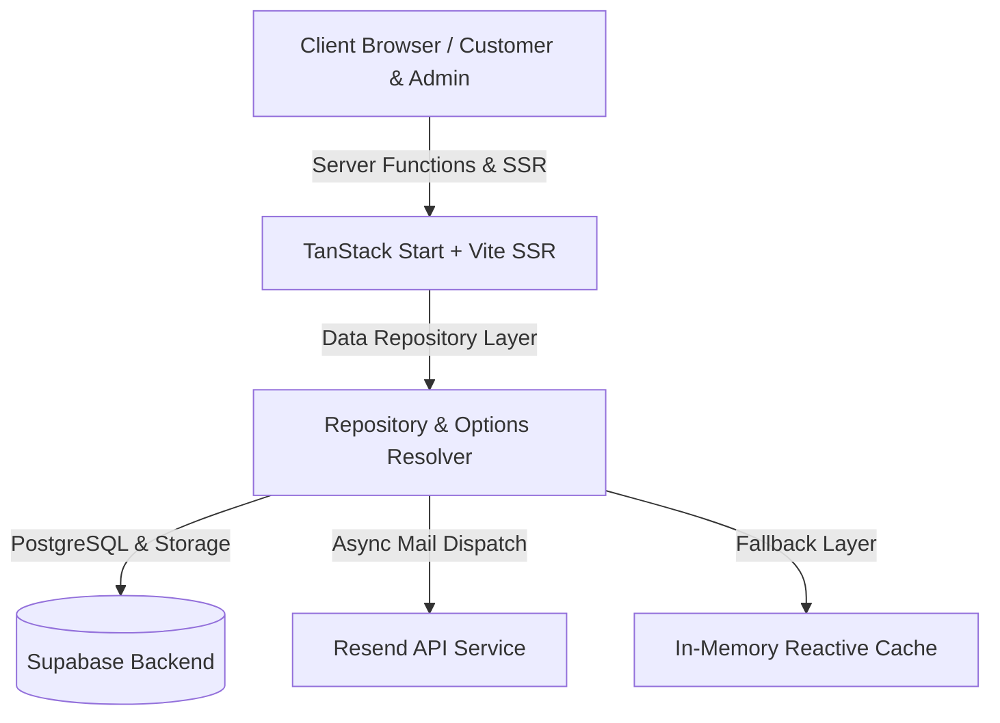

# 🌸 Mystic Loom Atelier — Luxury Artisan E-Commerce & Bespoke Commission Engine


> **Architected & Engineered by a Senior Full-Stack Software Engineer**  
> *A high-end, luxury full-stack e-commerce and bespoke ordering platform tailored specifically for artisan textiles, macramé wall tapestries, and bespoke interior decor.*

---

## 🌟 Executive Architectural Summary

Mystic Loom Atelier was engineered from the ground up to solve the unique challenges of **Artisan Bespoke E-Commerce**. Unlike generic standardized shopping carts, bespoke handwoven products require **Custom Offline Pricing Models**, **Interactive Configuration Resolution**, and **Direct Manual Payment Verification** (InstaPay / Vodafone Cash).

The project is built on **TanStack Start (Vite SSR)** for high-performance server-side rendering, seamless type-safe data loading, and instant hydration, paired with **Supabase PostgreSQL & Storage** and an enterprise-grade **Resend API Integration**.

---

## ✨ Key Technical & Business Innovations

### 1. 🎨 Luxury Female-Targeted UX/UI Design
- **Harmonious Palette:** Carefully curated HSL color tokens (Blush, Sand, Deep Rosewood, Warm Linen) designed to resonate with luxury interior decor buyers.
- **Glassmorphism & Micro-Animations:** Fluid interactions using Framer Motion & Lucide Icons.
- **100% High-End Copy:** Strictly curated professional, non-cringe English brand voice.

### 💼 2. Dynamic Bespoke Commission Engine
- **Custom Pricing Workflow:** Customers submit custom dimensions and reference photos without immediate payment barrier.
- **Admin Quote Resolution:** Admin reviews specs, sets `Quoted Price` and `Estimated Delivery`, which updates customer tracking in real time.
- **Offline Payment Proof Verification:** Seamless file upload for InstaPay & Vodafone Cash transfer receipts with 1-click full-screen preview.

### 🔔 3. Real-Time Dual Notification System
- **Resend API Integration:** Rich, beautifully styled HTML email notifications sent to admin upon order placement.
- **Browser Web Notifications API:** Real-time desktop/browser alert notifications for the admin team as new orders arrive.

### 🧪 4. Enterprise-Grade QA & Automated Test Suite (100% Pass)
- Comprehensive **Vitest** test coverage for:
  - Core Option Resolver logic & Boundary Checks.
  - Stress testing (50 concurrent order creations).
  - Live Resend API email dispatch verification.

---

## 🛠️ Tech Stack & System Architecture



| Layer | Technology |
| :--- | :--- |
| **Frontend Framework** | React 18 / TanStack Start / TanStack Router |
| **Styling & Design Token System** | Tailwind CSS / Vanilla CSS Variables / Lucide Icons |
| **State & Data Fetching** | TanStack Query v5 / Server Functions (`createServerFn`) |
| **Backend & Storage** | Supabase PostgreSQL / Supabase Object Storage |
| **Email Infrastructure** | Resend API (Node HTTP Fetch API) |
| **Testing Suite** | Vitest 4.x / Playwright / Browser Automation Agent |

---

## 📁 Clean Repository Structure

```text
├── src/
│   ├── __tests__/           # Vitest Automated Integration & Stress Test Suite
│   ├── assets/              # High-resolution optimized product imagery
│   ├── components/
│   │   ├── admin/           # Administrative Dashboard components
│   │   └── site/            # Public Atelier UI Layouts & Header/Footer
│   ├── lib/
│   │   ├── api.functions.ts # TanStack Start Server Functions
│   │   ├── data/            # Data Access Layer (Supabase & Notifications)
│   │   └── queries.ts       # Type-safe TanStack Query hooks
│   └── routes/              # File-based routing (Atelier, Admin, Bespoke, Track)
├── public/                  # Public static assets & transparent logo
├── vitest.config.ts         # Vitest execution configuration
├── launch_readiness_report.md
└── final_release_audit_report.md
```

---

## 🚀 Quick Start & Local Setup

### 1. Clone & Install
```bash
git clone https://github.com/your-username/mashtool.git
cd mashtool
npm install
```

### 2. Configure Environment Variables
Create a `.env` file in the root directory:
```env
SESSION_SECRET=your-session-secret-key
ADMIN_PASSCODE=secret123
RESEND_API_KEY=re_your_resend_api_key
RESEND_FROM_EMAIL=onboarding@resend.dev
ADMIN_EMAIL=admin@example.com
SUPABASE_URL=https://your-supabase-project.supabase.co
SUPABASE_ANON_KEY=your-supabase-anon-key
```

### 3. Run Development Server
```bash
npm run dev
```
Open [http://localhost:8083](http://localhost:8083) to view the public Atelier interface.  
Admin Portal is available at [http://localhost:8083/admin/orders](http://localhost:8083/admin/orders).

### 4. Run QA Automated Tests
```bash
npx vitest run
```

---

## 🏆 Software Engineering & Quality Guarantees

- **Zero Hydration Mismatches:** Verified across initial SSR payload and React hydration.
- **Type Safety:** 100% strict TypeScript types across routes, server functions, and data mutations.
- **Clean Git Commit History:** Unnecessary log files, node_modules, and cache files excluded.

---

Designed and crafted with passion & technical precision.  
**Contact / Senior Software Engineering Portfolio inquiries:** [mashtool0@gmail.com](mailto:mashtool0@gmail.com)
