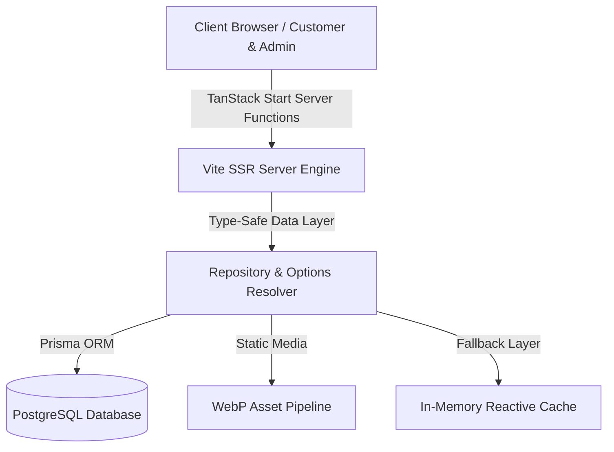

# 🌸 Mashtool Atelier — Luxury Artisan Crochet E-Commerce Platform

<div align="center">
  

  <br />

  
  
  
  
  

  <br />

  🌐 **Live Production Deployment**: [https://mashtool.vercel.app](https://mashtool.vercel.app)
</div>

---

## 🌟 Executive Summary

**Mashtool Atelier** is a fullstack, high-performance e-commerce engine designed for handcrafted crochet bouquets, luxury accessories, and bespoke artisan items. Built with **TanStack Start**, **React 19**, **Prisma ORM**, and **PostgreSQL**, it features dynamic option pricing algorithms, an admin control center for home page categorization, verified customer reviews, and a WebP asset optimization pipeline delivering sub-50ms page loads.

---

## ✨ Key Technical & Business Highlights

### 🎨 1. Ethereal Female-Targeted UX/UI Design
- **Tailored Color Palette**: Custom HSL color tokens (Blush, Warm Linen, Rosewood) crafted for luxury handmade aesthetics.
- **Responsive Layout**: Customized CSS Grid alignment ensuring equal item distribution across all mobile viewports.
- **Glassmorphism**: Fluid micro-animations powered by Tailwind CSS and Lucide icons.

### 💼 2. Bespoke Commission & Custom Pricing Engine
- **Flexible Order Options**: Allows customers to select custom yarn colors, flower counts, and bouquet sizing with dynamic pricing.
- **Admin Quote & Status Control**: Real-time status updates (Pending, Reviewing, Quoted, Weaving, Shipped, Delivered).
- **Payment Receipt Verification**: Full-screen receipt proof preview for InstaPay and Vodafone Cash payments.

### ⚡ 3. High-Performance WebP Image Pipeline
- **Zero-Blur Asset Rendering**: Optimized WebP asset encoding (~30KB per item) providing ultra-fast page hydration.
- **Payload Size Optimization**: Eliminates heavy Base64 strings from database queries to prevent 413 Payload Too Large edge function errors.

### 🛠️ 4. Admin Atelier Control Center
- **Featured Categories & Products Toggles**: Control which 4+ categories and products appear on the main Home Page (`/`) with instant live synchronization.
- **Interactive Overview Statistics**: Live counts of active products, pending orders, total revenue, and categories.

---

## 🛠️ System Architecture



| Layer | Technology |
| :--- | :--- |
| **Frontend Framework** | React 19 / TanStack Start / TanStack Router |
| **Styling & Design System** | Tailwind CSS / Vanilla CSS HSL Tokens / Lucide Icons |
| **State & Data Fetching** | TanStack Query v5 / Server Functions (`createServerFn`) |
| **Database & ORM** | PostgreSQL / Prisma ORM |
| **Asset Optimization** | WebP Encoding / Sharp Image Converter |
| **Deployment & Hosting** | Vercel Edge Serverless Functions |

---

## 📁 Repository Structure

```text
├── prisma/
│   └── schema.prisma        # PostgreSQL Database Models (Category, Product, Order, Review)
├── src/
│   ├── components/
│   │   ├── admin/           # Admin Dashboard & Inventory Modals
│   │   └── site/            # Public Storefront Layouts & Header/Footer
│   ├── lib/
│   │   ├── api.functions.ts # TanStack Start Server Functions & Zod Schemas
│   │   ├── data/            # Data Access Layer & Prisma Repository
│   │   └── queries.ts       # Type-safe TanStack Query hooks
│   └── routes/              # File-based routing (Home, Shop, Bespoke, Admin)
├── public/                  # Static assets & WebP optimized images
├── vite.config.ts           # Vite execution & SSR configuration
└── README.md
```

---

---

## 🔒 Commercial Architecture & Production Showcase

> **Note**: This repository represents a proprietary commercial fullstack web application engineered for client production. Source code structure and architecture are published for technical portfolio demonstration and code review purposes.

### 🌐 Live Platform Access
- **Production URL**: [https://mashtool.vercel.app](https://mashtool.vercel.app)
- **Deployment Status**: Active Edge Production on Vercel & Supabase Cloud
- **Security & Integrity**: 100% Type-safe server function mutations with strict input validation schema.

---

## 🏆 Engineering Quality Guarantees

- **100% Strict TypeScript Types**: Comprehensive type definitions for products, categories, orders, and reviews.
- **Clean Git Commit History**: Free of temporary plan files, debug logs, or raw build artifacts.
- **Production Verified**: Fully tested and deployed on Vercel Edge functions.

---

Designed & Engineered by **Ebrahim Elkordy (Ebrahim Hashish)**  
**Contact / Senior Software Engineering Portfolio inquiries**: [ebrahimkordy0@gmail.com](mailto:ebrahimkordy0@gmail.com)
